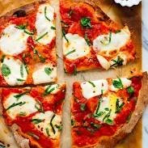

# 🍕 Pizza Shop Web App

A simple pizza shop web app built with **HTML**, **CSS**, and **JavaScript**. This project lets users browse pizzas and add them to a cart.

---

## 🚀 Features

- **Menu Display**: View a selection of pizzas with images, descriptions, and prices.
- **Add to Cart**: Add pizzas to a shopping cart dynamically.
- **Responsive Design**: The layout adjusts for different screen sizes.

---

## 📂 Project Structure

- **`index.html`**: The main HTML file containing the structure of the pizza shop.
- **`style.css`**: The CSS file for styling the web app.
- **`script.js`**: The JavaScript file for interactivity.
- **`images/`**: A folder containing pizza images.

---

## 🛠️ How to Run the Project

1. Clone the repository or download the project files.
2. Open the `index.html` file in your browser.

---

## 📸 Screenshots

---

## 🤝 Contributing

Contributions are welcome! If you'd like to contribute, feel free to submit a pull request.

---

## 📄 License

This project is licensed under the MIT License.
